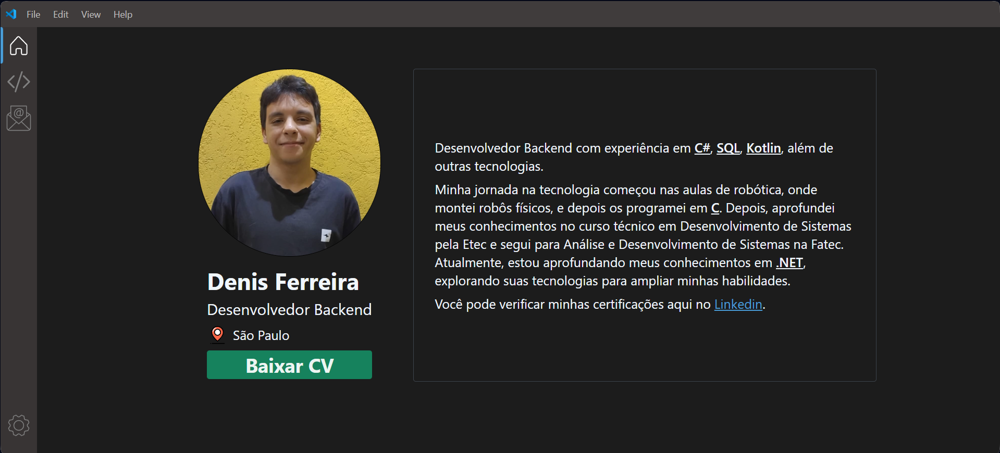
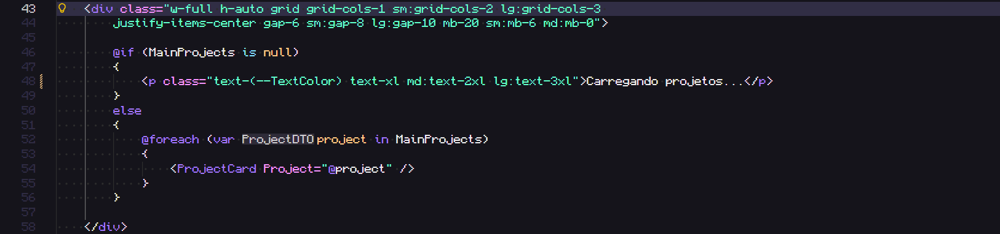
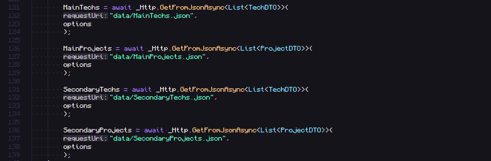

# portfolio-v2

Este projeto é a evolução do meu portfólio pessoal, agora desenvolvido com Blazor WebAssembly (WASM) e Tailwind CSS.
Ele mantém a inspiração visual na interface do Visual Studio Code, porém com um foco muito maior em arquitetura, componentização e organização do código.




## Tecnologias utilizadas


## Contexto

O Portfolio v2 é uma evolução direta do meu <a href="https://github.com/CostaDenis/Portfolio">portfólio anterior</a>, que foi desenvolvido utilizando HTML, Tailwind CSS e JavaScript puro.

Embora o projeto anterior cumprisse seu papel, ele acabou se tornando pouco escalável e difícil de manter, especialmente à medida que novas seções e projetos eram adicionados.

Neste novo projeto, a proposta foi reconstruir tudo do zero, aplicando conceitos que já utilizo no backend com .NET.

## Motivação

A principal motivação deste projeto foi explorar a componentização dentro do ecossistema .NET, utilizando o Blazor como base.
Essa abordagem torna a aplicação mais arquitetural, mais organizada e mais fácil de compreender e evoluir ao longo do tempo.

Como exemplo prático:
no portfólio antigo, cada novo projeto exigia copiar e colar toda a estrutura HTML (junto com as classes de Tailwind) de um card existente, o que fazia as páginas crescerem rapidamente e se tornarem difíceis de manter.

No Portfolio v2, basta instanciar um componente e passar um DTO (ProjectDTO), que contém todas as informações necessárias para renderizar o card.
Isso reduz duplicação de código, melhora a legibilidade e facilita futuras manutenções e expansões.

Criando novo card de projeto (antigo):


Criando novo card de projeto (novo):



## Deploy

O projeto é publicado utilizando GitHub Pages, com build estático do Blazor WebAssembly.


## Observação

As informações dos projetos, assim como as tecnologias utilizadas em cada um deles, são carregadas dinamicamente a partir de arquivos .json localizados em wwwroot/Data.

No Blazor, esses arquivos são consumidos via HttpClient, convertidos para DTOs, e então utilizados pelos componentes responsáveis pela renderização.



## Pré Requisitos para executar localmente

- <a href="https://dotnet.microsoft.com/pt-br/download/dotnet/9.0">.NET 9</a>

- <a href="https://nodejs.org/pt/download">Node.js</a>

## Executando

Clone o repositório:
  ```bash
  git clone git@github.com:CostaDenis/portfolio-v2.git
  ```

Instale as dependências do NPM na pasta do projeto:
  ```bash
  npm install
  ```

Inicie o Tailwind CSS:
  ```bash
    npm run watch
  ```

Execute a aplicação:
  ```bash
    dotnet watch run
  ```

